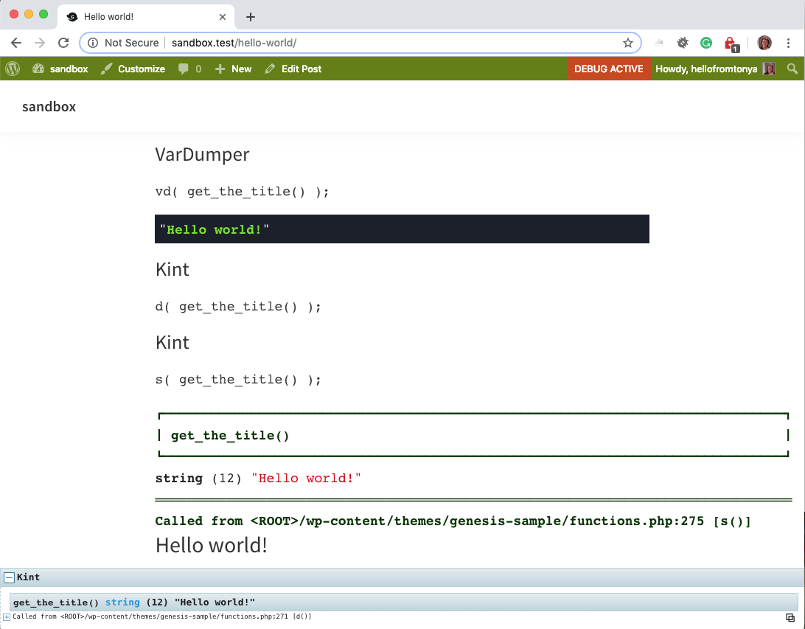
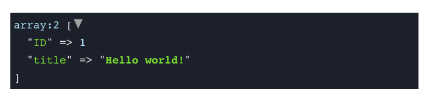
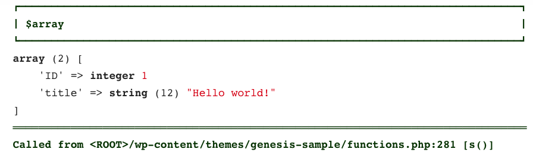
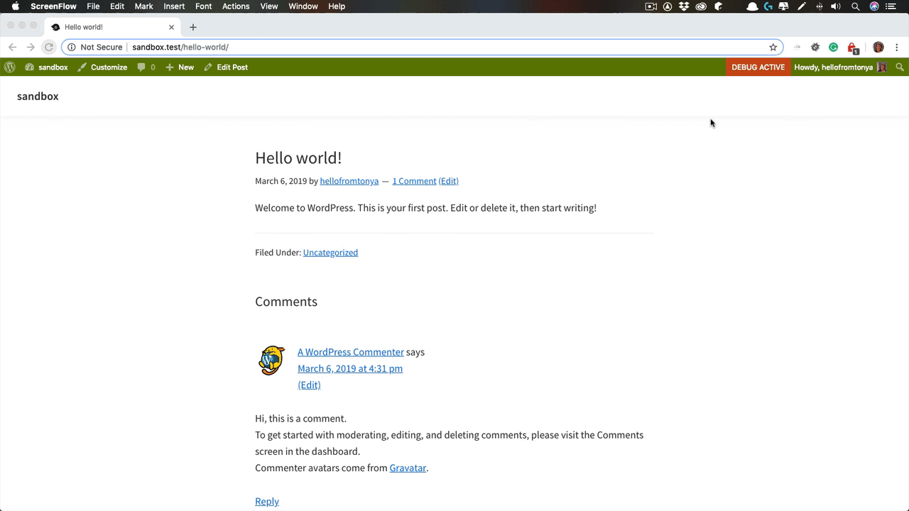

# Developer Debug Toolkit

Code debug made easier and more enjoyable.  This WordPress plugin includes a suite of developer essential tools to debug your code.

Here's what you get:

* Better PHP error interface from ([Whoops](http://filp.github.io/whoops/))
* Better variable inspection - no need to use `var_dump`, `print_r`, or X-debug
    * [VarDumper from Symfony](https://symfony.com/doc/current/components/var_dumper.html)
    * [Kint - a modern and powerful PHP debugging helper](https://kint-php.github.io/kint/)
* An interactive way to back trace the program's execution order

## Requirements

* PHP 5.6 and up

## Table of Contents

* [Better Variable Inspection](#better-variable-inspection)
    * [Functions](#variable-dumper-functions)
* [Backtracing the Call Stack](#backtracing-the-call-stack)
    * [Functions](#trace-functions)
* [Better PHP Error Interface](#better-php-error-interface)
* [Admin Bar Indicator](#admin-bar-indicator)

[Watch an introductory video on Vimeo](https://vimeo.com/322351688)

## Better Variable Inspection

Though X-debug is powerful, it can be difficult to set up and run.  For that reason, it's common to dump or print out the variable to browser.  But the built-in display for the PHP `var_dump` and `print_r` is basic.

This plugin includes both two very popular variable dumper tools:

* [VarDumper from Symfony](https://symfony.com/doc/current/components/var_dumper.html)
* [Kint - a modern and powerful PHP debugging helper](https://kint-php.github.io/kint/)

VarDumper provides a simple container that displays where you place it.

Kint gathers all the data and displayed it at the bottom of the screen as a fixed position container.  It also provides a call stack, which can be handy, and tracing functionality if you need it.

### Which one should you use?

It depends.

1. You want to simply display the contents of a variable: Use VarDumper's functions, i.e. `vdump()`, `vd()`, `vdd()`, or `vddd()`.
2. You want the call stack in addition to the variable:  Use Kint's functions: `d()`, `dd()`, or `ddd()`.

### Variable Inspection Functions

| Task      | VarDumper | Kint     |
| :---        | :---    | :---  |
| Dumps the given variable(s) | `vdump( mixed $var );` | `dump( mixed $var [ , mixed $var2, ...] );` |
| Dumps and dies   | `vdump_and_die( mixed $var );` | `dump_and_die( mixed $var [ , mixed $var2, ...] );` |

>**TIP**
>Use the full functions instead of the aliases.  Why?  It's easier to search your code to find where you put each of them. Searching for `d(`, for example, can be frustrating.  But searching for `dump(`, that will be a more targeted search.

**Alias (shorthand) Functions**

| Task      | VarDumper | Kint     |
| :---        | :---    | :---  |
| Dumps plain text | na | `s( mixed $var [ , mixed $var2, ...] );` |
| Dumps the given variable(s) | `vd( mixed $var );` | `d( mixed $var [ , mixed $var2, ...] );` |
| Dumps and dies   | `vdd( mixed $var );` | `dd( mixed $var [ , mixed $var2, ...] );` |
| Dumps and dies   | `vddd( mixed $var );` | `ddd( mixed $var [ , mixed $var2, ...] );` |

#### Examples

Using the VarDumper functions:

```php
add_action( 'loop_start', function() {
	global $post;

	$array = [
		'ID'    => get_the_ID(),
		'title' => get_the_title(),
	];

	vdump( $array );
	vdump_and_die( $post );
} );
```

It renders like this:



Using the Kints functions:

```php
add_action( 'loop_start', function() {
	global $post;

	$array = [
		'ID'    => get_the_ID(),
		'title' => get_the_title(),
	];

	dump( $array );
	dump_and_die( $post );
} );
```

It renders like this:



Notice the subtle differences between them:

* VarDumper's functions provide a very simple highlighter container.
* Kint is shown at the bottom of the screen.  Notice that it provides more information.

Here's the example code for `s()`:

```php
add_action( 'loop_start', function() {
	$array = [
		'ID'    => get_the_ID(),
		'title' => get_the_title(),
	];

	s( $array );
} );
```

It renders as:



## Better PHP Error Interface from Whoops

The built-in PHP error container is basic and not as helpful as it could be.  On top of that, it's rather ugly. Wouldn't you agree?

The Whoops package gives you a cool interface that is helpful, interactive, and quite nice to look at.

Consider the error this code would produce:

```php
add_action( 'loop_start', function() {
	does_not_exist();
} );
```


You can learn more about Whoops by visiting [http://filp.github.io/whoops/](http://filp.github.io/whoops/).

## Backtracing the Call Stack

When debugging, there are times when you need to see the order in which functions were called that lead to a certain point in the program.  PHP offers a backtrace that traces back the execution order from the point when the function is invoked.

To make backtracing easier, this plugin provides you with a `trace()` function and combines it with the variable dumper functions.

### Trace Functions

| Task      | VarDumper | Kint     |
| :---        | :---    | :---  |
| Dumps backtrace | na | `trace();` |
| Dumps backtrace + given variable(s) | `trace_vdump( mixed $var );` | `trace_dump( mixed $var [ , mixed $var2, ...] );` |
| Dumps backtrace + variable(s) and then dies   | `trace_vdump_and_die()( mixed $var );` | `trace_dump_and_die()( mixed $var [ , mixed $var2, ...] );` |
| Alias for trace and dump   | `trace_vdump_and_die()( mixed $var );` | `traced()( mixed $var [ , mixed $var2, ...] );` |
| Alias for trace and dump and die   | `tracevdd()( mixed $var );` | `tracedd()( mixed $var [ , mixed $var2, ...] );` |
| Alternative alias for trace and dump and die   | `tracevddd()( mixed $var );` | `traceddd()( mixed $var [ , mixed $var2, ...] );` |

The `trace();` function will render the call stack that lead up to where you invoke the function. For example, if you added this code at the end of your theme's `functions.php` file:

```php
add_action( 'loop_start', function() {
	trace();
} );
```

the `trace()` renders as:


Notice that the container is interactive.  Click on each call stack item and its associated code appears.  This is a powerful debugging tool to discover the execution order through your code.

## Admin Bar Indicator

As this tool is meant for development mode only, you need a way to know the plugin is enabled.  No problem. A "DEBUG MODE" indicator is added to the WordPress admin bar.


