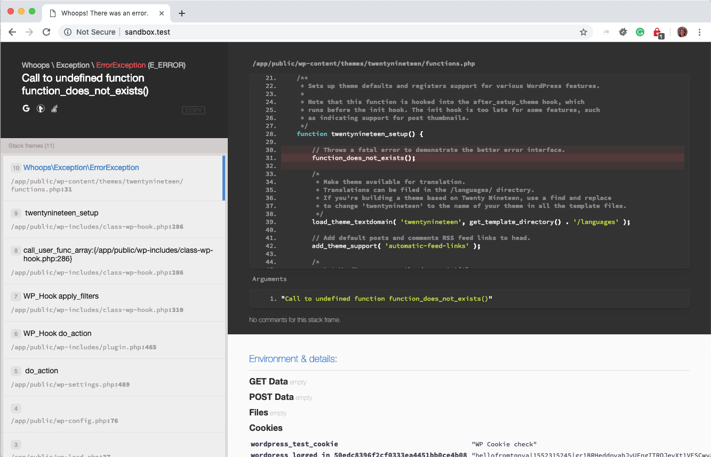
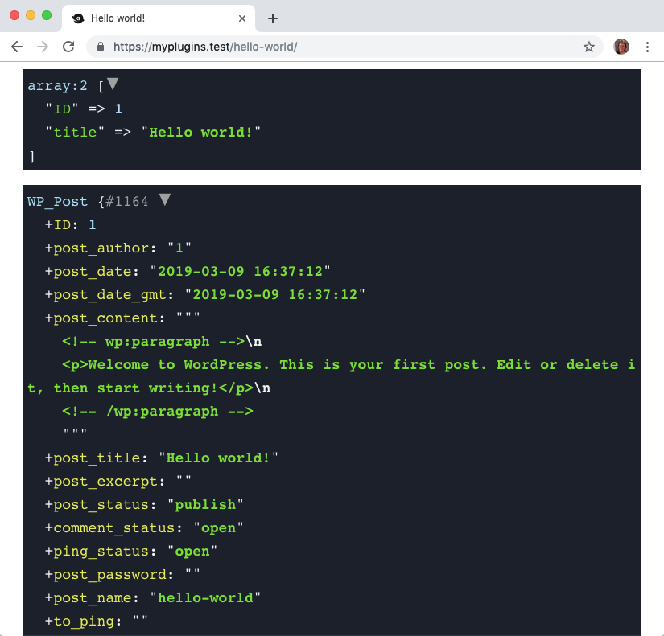
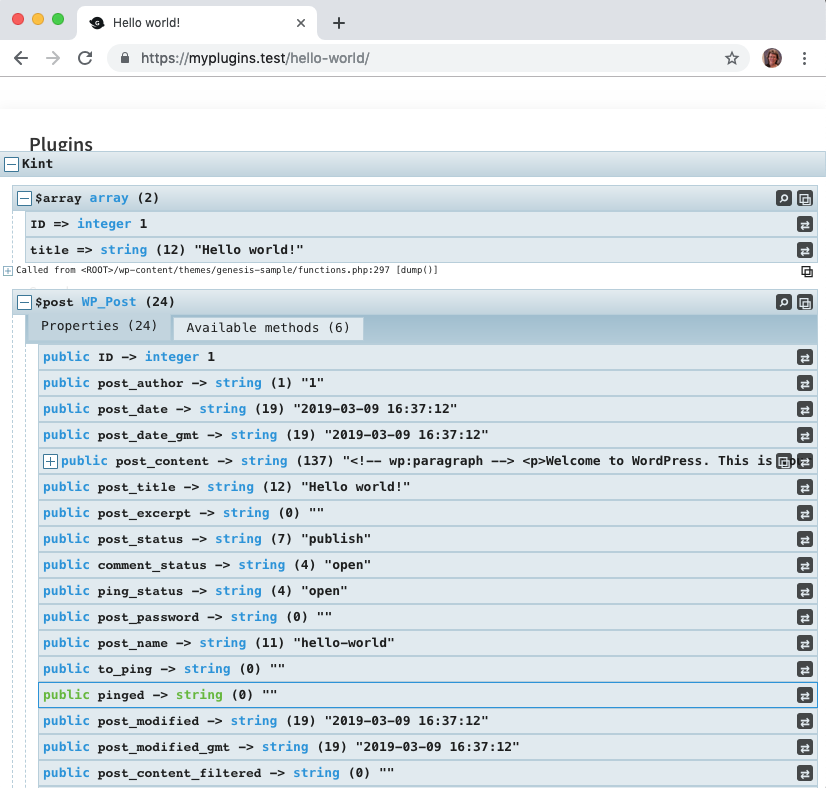

# Developer Debug Toolkit

Code debug made easier and more enjoyable.  This WordPress plugin includes a suite of developer essential tools to debug your code.

Tools include:

* [Whoops - the "PHP errors for cool kids"](http://filp.github.io/whoops/)
* [VarDumper from Symfony](https://symfony.com/doc/current/components/var_dumper.html)
* [Kint - a modern and powerful PHP debugging helper](https://kint-php.github.io/kint/)

## Table of Contents

* [Debugging Variable Dumpers](#debugging-variable-dumpers)
    * [Functions](#variable-dumper-functions)
* [Backtracing the Call Stack](#backtracing-the-call-stack)
    * [Functions](#trace-functions)
* [Whoops - An Awesome PHP Error Tool](#whoops---an-awesome-php-error-tool)
* [Admin Bar Indicator](#admin-bar-indicator)

## Debugging Variable Dumpers

This plugin provides two different tools for dumping variables:

* VarDumper from Symfony
* Kint

VarDumper provides a simple container that displays where you place it.

Kint gathers all the data and displayed it at the bottom of the screen as a fixed position container.  It also provides a call stack, which can be handy, and tracing functionality if you need it.

### Which one should you use?

It depends.

1. You want to simply display the contents of a variable: Use VarDumper's functions, i.e. `vdump()`, `vd()`, `vdd()`, or `vddd()`.
2. You want the call stack in addition to the variable:  Use Kint's functions: `d()`, `dd()`, or `ddd()`.

### Variable Dumper Functions

| Task      | VarDumper | Kint     |
| :---        | :---    | :---  |
| Dumps the given variable(s) | `vd( mixed $var );` | `d( mixed $var [ , mixed $var2, ...] );` |
| Dumps the given variable(s) | `vdump( mixed $var );` | `Kint::dump( mixed $var [ , mixed $var2, ...] );` |
| Dumps and dies   | `vdd( mixed $var );` | `dd( mixed $var [ , mixed $var2, ...] );` |
| Dumps and dies   | `vddd( mixed $var );` | `ddd( mixed $var [ , mixed $var2, ...] );` |
| Dumps and dies   | `vddd( mixed $var );` | `ddd( mixed $var [ , mixed $var2, ...] );` |
| Dumps plain text | na | `s( mixed $var [ , mixed $var2, ...] );` |
| Dumps debug backtrace | na | `trace();` |

For example:

```php
add_action( 'loop_start', function() {

	echo '<h2>VarDumper</h2>';
	echo '<pre><code>vd( get_the_title() );</code></pre>';
	vd( get_the_title() );

	echo '<h2>Kint</h2>';
	echo '<pre><code>d( get_the_title() );</code></pre>';
	d( get_the_title() );

	echo '<h2>Kint</h2>';
	echo '<pre><code>s( get_the_title() );</code></pre>';
	s( get_the_title() );

} );
```

It renders like this:



Notice the subtle differences between the three different ways of dumping the title out to the browser:

* VarDumper's `vd()` provides a very simple highlighter around the title.
* Kint's `d()` is shown at the bottom of the screen and contains the function, string length, title, and call stack.
* Kint's `s()` provides a similar display as `vd()` except that it also includes what was passed into the function (shown in the dashed box), string length, value (title), and where the function was called from in your code.

#### How about for arrays, objects, etc?

Here's the example code for `vd()`:

```php
add_action( 'loop_start', function() {
	$array = [
		'ID'    => get_the_ID(),
		'title' => get_the_title(),
	];

	vd( $array );
} );
```

It renders as:



Here's the example code for `d()`:

```php
add_action( 'loop_start', function() {
	$array = [
		'ID'    => get_the_ID(),
		'title' => get_the_title(),
	];

	d( $array );
} );
```

It renders as:



Here's the example code for `s()`:

```php
add_action( 'loop_start', function() {
	$array = [
		'ID'    => get_the_ID(),
		'title' => get_the_title(),
	];

	s( $array );
} );
```

It renders as:


## Whoops - An Awesome PHP Error Tool

The built-in PHP error container is basic and not as helpful as it could be.  On top of that, it's rather ugly. Wouldn't you agree?

The Whoops package gives you a cool interface that is helpful, interactive, and quite nice to look at.

Consider the error this code would produce:

```php
add_action( 'loop_start', function() {
	does_not_exist();
} );
```


You can learn more about Whoops by visiting [http://filp.github.io/whoops/](http://filp.github.io/whoops/).

## Backtracing the Call Stack

When debugging, there are times when you need to see the order in which functions were called that lead to a certain point in the program.  PHP offers a backtrace that traces back the execution order from the point when the function is invoked.

To make backtracing easier, this plugin provides you with a `trace()` function and combines it with the variable dumper functions.

### Trace Functions

| Task      | VarDumper | Kint     |
| :---        | :---    | :---  |
| Dumps backtrace | na | `trace();` |
| Dumps backtrace + given variable(s) | `vdtrace( mixed $var );` | `dtrace( mixed $var [ , mixed $var2, ...] );` |
| Dumps backtrace + variable(s) and then dies   | `vddtrace( mixed $var );` | `ddtrace( mixed $var [ , mixed $var2, ...] );` |
| Dumps backtrace + variable(s) and then dies   | `vdddtrace( mixed $var );` | `dddtrace( mixed $var [ , mixed $var2, ...] );` |

The `trace();` function will render the call stack that lead up to where you invoke the function. For example, if you added this code at the end of your theme's `functions.php` file:

```php
add_action( 'loop_start', function() {
	trace();
} );
```

the `trace()` renders as:


Notice that the container is interactive.  Click on each call stack item and its associated code appears.  This is a powerful debugging tool to discover the execution order through your code.

## Admin Bar Indicator

As this tool is meant for development mode only, you need a way to know the plugin is enabled.  No problem. A "DEBUG MODE" indicator is added to the WordPress admin bar.


